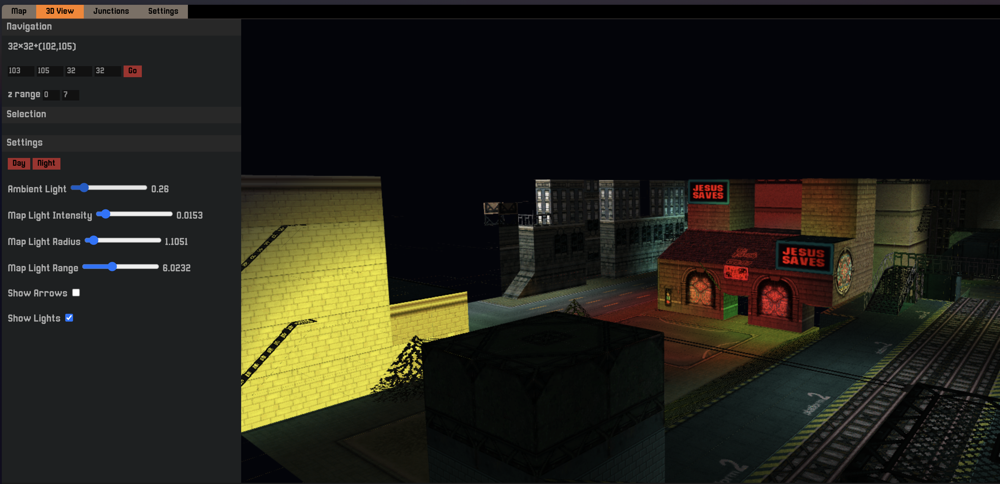

# GTA2 Map Editor



## Usage

Please mind that this is quite an early stage of development.

Obviously, you'll need `.gmp` and `.sty` files from the game. As of now, the
editor loads two hard-coded files from the `public/` folder because I focused
on the more engaging stuff:

- `ste.gmp`
- `ste.sty`

```shell
$ npm i
$ npm run dev
```

## Does it work?

Yes, the basic block editing does work although at this point it's a bit pain to
use. The map is currently only exported in the UMAP format and doesn't include
other chunks than UMAP and ZONE so it has to be loaded into the official DMA
editor and exported as a compressed map so the game is able to use it.

Because currently no map objects are exported, you'll need to compile a most
basic SCR file. ([Project Cerebra](https://projectcerbera.com/gta/2/) might
be helpful in acheiving that).

```
PLAYER_PED p = (6.0,3.0,255.0) 0 0

LEVELSTART
LEVELEND
```

All of the chunks containing stuff like lighting, map objects, compressed blocks
etc. are planned to be supported. I don't plan to generate PSXM data or CMAP
but if you'd like to, you can always contribute.

## Status/Backlog

### Backlog

- [ ] Easy block navigation/addition
- [ ] Direct DMAP export
- [ ] Lighting support
- [ ] Animations
- [ ] Custom Files in the import menu
- [ ] Zones
- [ ] Map objects
- [ ] Caching the loaded map between reloads

#### GMP Support Status

| chunk | import | export | desc                  |
| ----- | ------ | ------ | --------------------- |
| CMAP  | –      | –      | 16-bit compressed map |
| DMAP  | yes    |        | 32-bit compressed map |
| UMAP  |        | yes    | uncompressed map      |
| ZONE  | yes    | yes    | 32-bit compressed map |
| LGHT  | yes    |        | lighting              |
| ANIM  | yes    | broken | animations            |
| MOBJ  |        |        | map objects           |
| RGEN  |        |        | junction data         |
| PSXM  | –      | –      | PlayStation mapping   |

#### STY Support Status

| chunk | import | export | desc                |
| ----- | ------ | ------ | ------------------- |
| PALX  | yes    |        | palette index       |
| PPAL  | yes    |        | palette color data  |
| PALB  | yes    |        | palette bases       |
| TILE  | yes    |        | textures            |
| SPRG  |        |        | sprite graphics     |
| SPRX  |        |        | sprite index        |
| SPRB  |        |        | sprite kind offsets |
| DELS  |        |        | delta store         |
| DELX  |        |        | delta index         |
| FONB  |        |        | font offsets        |
| CARI  |        |        | car info            |
| OBJI  |        |        | map object info     |
| PSXT  | –      | –      | PlayStation tiles   |
| RECY  |        |        | car recycling info  |

#### SCR Support Status

none at the moment

## Some docs

Available [here](docs/index.md)

## Assets

Using [Gouranga Font](https://www.behance.net/gallery/83927231/Gouranga-Font-PixelArt)
by Felix Huber.
