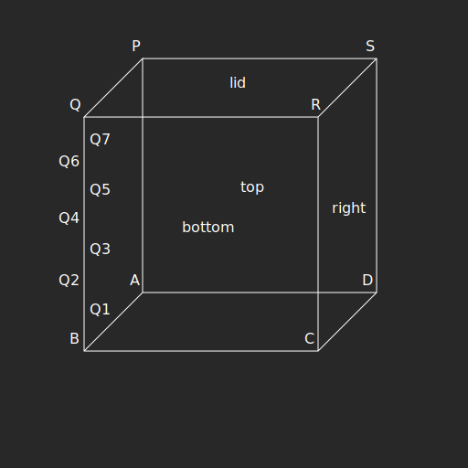

# Doxx

## Keymapping

- `C` - center camera
- `F` - focus on selected block
- `I` - show babylon.js debug layer
- `WSAD` - move through the map by 1 block
- `shift+WSAD` - move through the map by half the size of the map view

## Mesh points naming convention

## Axes mapping

Babylon uses a different coordinate system from the GMP format.

| GMP coordinate | Babylon | description   |
| -------------- | ------- | ------------- |
| x              | z       | east-west     |
| y              | x       | north-south   |
| z              | y       | column height |
